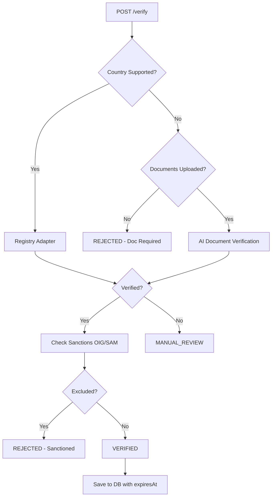

# VeriMed Architecture

> **Version**: 1.0 | **Updated**: December 2025

## Overview

VeriMed is a healthcare credential verification API built for **NCQA 2025 compliance**. It verifies medical professionals against official government registries using Primary Source Verification (PSV).

---

## Technology Stack

| Layer | Technology |
|-------|------------|
| **Runtime** | Node.js 20+ |
| **Framework** | NestJS 10 |
| **Database** | PostgreSQL (prod) / SQLite (dev) |
| **ORM** | TypeORM |
| **API Docs** | Swagger/OpenAPI |
| **AI** | OpenAI Vision (document analysis) |

---

## Project Structure

```
src/
├── main.ts                    # Application entry point
├── app.module.ts              # Root module configuration
│
├── domain/                    # Core Business Logic (No dependencies)
│   ├── entities/              # Domain entities
│   │   ├── verification-request.entity.ts
│   │   └── verification-result.entity.ts
│   ├── enums/
│   │   └── verification-status.enum.ts
│   └── ports/                 # Interfaces (Dependency Inversion)
│       ├── registry-adapter.port.ts
│       ├── document-verifier.port.ts
│       └── verification-repository.port.ts
│
├── application/               # Use Cases & DTOs
│   ├── use-cases/
│   │   └── verify-provider.use-case.ts
│   └── dtos/
│       ├── create-verification.dto.ts
│       └── review-verification.dto.ts
│
├── infrastructure/            # External Implementations
│   ├── adapters/
│   │   ├── registry/          # Government API adapters (5 countries)
│   │   └── document/          # AI document verifiers
│   ├── controllers/           # HTTP endpoints
│   ├── guards/                # API Key authentication
│   ├── persistence/           # Database entities & repositories
│   ├── services/              # Sanctions checking (LEIE, SAM)
│   ├── jobs/                  # Scheduled cron jobs
│   └── auth/                  # JWT authentication module
│
└── common/                    # Shared utilities
    ├── config/                # Environment validation
    └── filters/               # Exception handling
```

---

## Core Architecture Pattern

VeriMed follows **Clean Architecture** with dependency inversion:

```
┌─────────────────────────────────────────────────────────────────┐
│                         Controllers                              │
│         (HTTP Layer - NestJS Controllers, Swagger)               │
└─────────────────────────────────────────────────────────────────┘
                              │
                              ▼
┌─────────────────────────────────────────────────────────────────┐
│                         Use Cases                                │
│              (Application Layer - Business Logic)                │
│                    VerifyProviderUseCase                         │
└─────────────────────────────────────────────────────────────────┘
                              │
            ┌─────────────────┼─────────────────┐
            ▼                 ▼                 ▼
┌───────────────────┐ ┌───────────────┐ ┌───────────────────┐
│ Registry Adapters │ │ Document      │ │ Verification      │
│ (IRegistryAdapter)│ │ Verifier      │ │ Repository        │
│                   │ │ (IDocVerifier)│ │ (IVerfRepository) │
└───────────────────┘ └───────────────┘ └───────────────────┘
        │                     │                   │
        ▼                     ▼                   ▼
┌───────────────────┐ ┌───────────────┐ ┌───────────────────┐
│ Government APIs   │ │ OpenAI Vision │ │ PostgreSQL/SQLite │
│ (CMS, ANS, etc.)  │ │               │ │                   │
└───────────────────┘ └───────────────┘ └───────────────────┘
```

---

## API Endpoints

| Method | Endpoint | Description | Auth |
|--------|----------|-------------|------|
| `POST` | `/verify` | Submit verification request | API Key |
| `GET` | `/verify/:id` | Get verification status | API Key |
| `PUT` | `/verify/:id/review` | Manual review (approve/reject) | JWT |
| `GET` | `/health` | Health check | None |

---

## Registry Adapters

Official government APIs only (5 countries):

| Country | Adapter | API Source | Protocol |
|---------|---------|------------|----------|
| 🇺🇸 USA | `UsNpiRegistryAdapter` | CMS NPPES | REST |
| 🇫🇷 France | `FrAnsRegistryAdapter` | ANS | FHIR R4 |
| 🇦🇪 UAE | `AeDhaRegistryAdapter` | Dubai Pulse | REST |
| 🇳🇱 Netherlands | `NlBigRegistryAdapter` | CIBG | SOAP |
| 🇮🇱 Israel | `IlMohRegistryAdapter` | data.gov.il | CKAN |

### Unsupported Countries

Countries without official API adapters require **document upload**. AI verification via OpenAI Vision provides confidence scoring.

---

## Sanctions Checking

Federal exclusion list verification for US providers:

| Service | Source | Implementation |
|---------|--------|----------------|
| **GSA SAM** | api.sam.gov | Live API (free tier) |
| **OIG LEIE** | oig.hhs.gov | CSV cache + indexing |

LEIE database downloads monthly, indexes by NPI and Name for fast lookups.

---

## Verification Flow



---

## Compliance Features

### NCQA 2025 Requirements

| Requirement | Implementation |
|-------------|----------------|
| **Primary Source Verification** | Official government API adapters |
| **Audit Trail** | All verifications logged with metadata |
| **120-Day Windows** | `expiresAt` column, daily alerts, auto-reverify |
| **Sanctions Checking** | OIG LEIE + GSA SAM integration |
| **Document Storage** | File upload with MIME validation |

### Database Schema

```sql
verification_logs (
  id UUID PRIMARY KEY,
  providerId VARCHAR NOT NULL,
  countryCode VARCHAR NOT NULL,
  status VARCHAR NOT NULL,          -- VERIFIED, REJECTED, PENDING, MANUAL_REVIEW
  method VARCHAR NOT NULL,          -- API_REGISTRY, AI_DOCUMENT
  confidenceScore FLOAT,
  attributes JSON,
  metadata JSON,
  timestamp DATETIME DEFAULT NOW(),
  expiresAt DATETIME,               -- 120 days from verification
  verificationSource VARCHAR        -- PRIMARY_SOURCE, DOCUMENT_AI
)
```

---

## Security

| Feature | Implementation |
|---------|----------------|
| **API Authentication** | API Key (`X-API-Key` header) |
| **Admin Authentication** | JWT (for review endpoint) |
| **Rate Limiting** | 10 requests/minute (Throttler) |
| **File Validation** | MIME type + magic bytes |
| **Input Validation** | class-validator DTOs |

---

## Scheduled Jobs

| Job | Schedule | Purpose |
|-----|----------|---------|
| **Expiration Alerts** | Daily 6 AM | Warn of verifications expiring in 14 days |
| **Auto Reverify** | Weekly | Re-verify expired providers |
| **LEIE Refresh** | 1st of month | Download fresh OIG exclusion CSV |

---

## Environment Variables

| Variable | Required | Description |
|----------|----------|-------------|
| `DATABASE_URL` | No | PostgreSQL connection string |
| `API_KEY` | Yes | API authentication key |
| `JWT_SECRET` | Yes | JWT signing secret |
| `AI_API_KEY` | No | OpenAI API key (enables AI verification) |
| `SAM_API_KEY` | No | GSA SAM API key (higher rate limits) |
