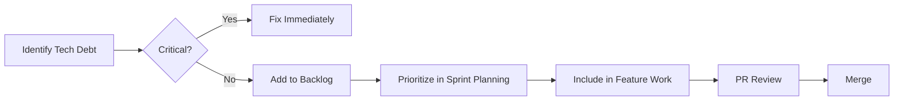

# Continuous Refactoring Strategy

**Version**: 1.0
**Date**: December 2025
**Owner**: Engineering Team

---

## Purpose

This document defines VeriMed's approach to managing and reducing technical debt through continuous refactoring, ensuring the codebase remains maintainable, secure, and performant.

---

## Principles

### 1. Boy Scout Rule
> "Leave the code better than you found it."

Every PR should include at least one small improvement to surrounding code:
- Rename unclear variables
- Add missing type annotations
- Improve error messages
- Add missing tests

### 2. Refactor in Context
Refactoring should happen during feature work, not as separate "cleanup" sprints:
- ✅ Refactor while implementing a feature that touches the code
- ❌ Create massive "refactoring PRs" that touch unrelated files

### 3. Measure Before Optimizing
Use data to prioritize refactoring:
- Code coverage reports (aim >80%)
- Cyclomatic complexity metrics
- Dependency analysis
- Security audit findings

---

## Refactoring Priorities

### High Priority (Address Immediately)
| Category | Criteria | Action |
|----------|----------|--------|
| Security vulnerabilities | Any CVE in dependencies | Update immediately |
| Broken tests | Failing CI | Fix before merge |
| Type safety | `any` types in domain layer | Add proper types |

### Medium Priority (Next Sprint)
| Category | Criteria | Action |
|----------|----------|--------|
| Code duplication | >50 lines duplicated | Extract to utility |
| Long functions | >100 lines | Split into smaller functions |
| Missing tests | <60% coverage for file | Add tests |

### Low Priority (Backlog)
| Category | Criteria | Action |
|----------|----------|--------|
| Naming improvements | Unclear variable names | Rename |
| Documentation | Missing JSDoc | Add docs |
| Performance | Sub-optimal but working | Optimize when scaling |

---

## Refactoring Workflow



---

## Technical Debt Tracking

### Labeling in Code
Use standardized comments for tech debt:

```typescript
// TODO: [TECH-DEBT] Description of what needs improvement
// PRIORITY: low|medium|high
// TICKET: VERI-123 (optional)
```

### Metrics Dashboard
Track these metrics monthly:
- Lines of code per module
- Test coverage percentage
- Cyclomatic complexity
- Dependency freshness
- Linter violations

---

## Scheduled Maintenance

### Weekly
- Review Dependabot alerts
- Address critical security updates

### Monthly
- Run `npm audit` and fix issues
- Review code coverage trends
- Update OWASP checklist

### Quarterly
- Major dependency upgrades
- Architecture review
- Performance benchmarking with k6

---

## Anti-Patterns to Avoid

| Anti-Pattern | Why It's Bad | Better Approach |
|--------------|--------------|-----------------|
| Big Bang Rewrites | High risk, long timelines | Incremental strangler fig |
| Refactoring without tests | Introduces bugs | Write tests first |
| Premature optimization | Wastes time | Measure first, optimize second |
| Gold plating | Scope creep | YAGNI (You Ain't Gonna Need It) |

---

## Success Metrics

| Metric | Target | Current |
|--------|--------|---------|
| Test Coverage | >80% | ~75% |
| Build Time | <2 min | ~1.5 min |
| Linter Violations | 0 | 0 |
| Security Vulnerabilities | 0 critical | 0 |
| Dependency Freshness | <6 months old | ✅ |

---

**Approved By**: [Tech Lead]
**Next Review**: Q1 2026
